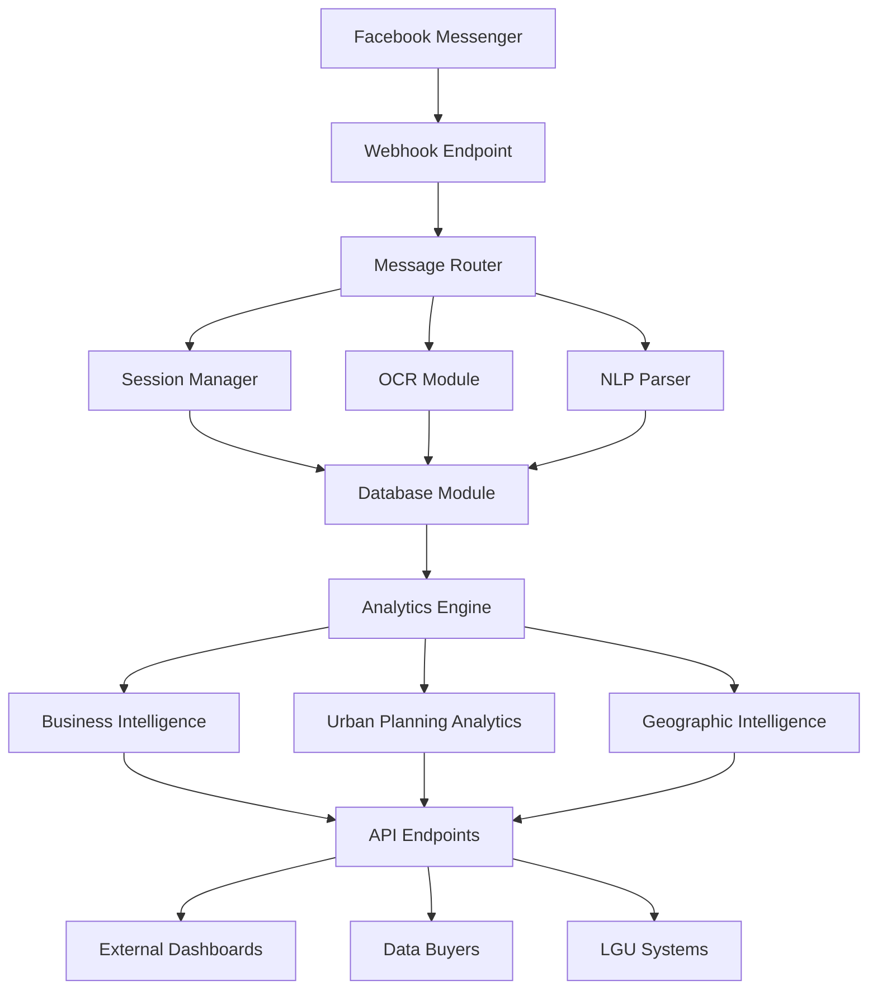

# 🏪 KitaKits: Intelligent Inventory & Data Analytics Platform

<div align="center">

[](https://nodejs.org/)
[](https://expressjs.com/)
[](https://www.sqlite.org/)
[](https://developers.facebook.com/)
[](https://opensource.org/licenses/MIT)

*An intelligent Facebook Messenger chatbot that transforms MSME inventory management into valuable business intelligence and urban planning insights.*

[🚀 Quick Start](#-quick-setup) • [📖 Features](#-features) • [🔧 API](#-api-endpoints) • [🏗️ Architecture](#-architecture) • [📊 Analytics](#-analytics-capabilities)

</div>

---

## 🌟 Project Overview

**KitaKits** is a dual-purpose platform that serves as both a practical inventory management tool for Filipino MSMEs (Micro, Small & Medium Enterprises) and a powerful data intelligence system. Built as a Facebook Messenger chatbot, it provides an intuitive interface for sari-sari stores, carinderias, and small food retailers while generating valuable insights for business intelligence and urban planning.

### 🎯 Core Value Proposition

- **📱 For MSMEs**: Simple inventory tracking via voice, text, and image recognition
- **📊 For Data Buyers**: Real-time consumer behavior, pricing patterns, and market dynamics
- **🏙️ For Urban Planners**: Community-level economic activity and demographic insights
- **🏛️ For LGUs**: Hyperlocal market intelligence for policy and development decisions

### 📈 Market Context

With over **1.2 million food-related MSMEs** in the Philippines (99.63% of all establishments), KitaKits transforms everyday inventory tracking into a nationwide layer of economic intelligence, accessible through Facebook Messenger's **80.30 million Filipino users**.

---

## ✨ Features

### 🏪 Core MSME Features

| Feature | Description | User Benefit |
|---------|-------------|--------------|
| 📦 **Smart Inventory Management** | Voice, text, and image-based item tracking | Reduce spoilage, track stock levels |
| 🧾 **OCR Receipt Processing** | Automatic text extraction from receipts and invoices | Faster data entry, reduced errors |
| 💰 **Sales Recording** | Quick sales transaction logging | Better revenue tracking |
| 📊 **Stock Monitoring** | Real-time inventory levels and alerts | Prevent stockouts and overstocking |
| ⚠️ **Expiry Alerts** | Automated notifications for expiring items | Minimize wastage, maximize profits |
| 📱 **Messenger Integration** | No-install required, familiar interface | Easy adoption, immediate use |

### 📈 Advanced Analytics Features

| Component | Capability | Output |
|-----------|------------|--------|
| 🎯 **Business Intelligence** | Sales patterns, top performers, revenue insights | Excel reports, trend analysis |
| 🌍 **Geographic Analytics** | Location-based market behavior | Regional demand patterns |
| 👥 **User Behavior Analysis** | Interaction patterns, engagement metrics | User segmentation insights |
| ⏱️ **Temporal Analytics** | Time-series analysis of transactions | Peak hours, seasonal trends |
| 🛒 **Product Performance** | Item-level sales and inventory data | Product recommendations |
| 💡 **Predictive Insights** | Demand forecasting, inventory optimization | Proactive restocking alerts |

### 🏙️ Urban Planning & Community Intelligence

| Data Layer | Insight Type | Applications |
|------------|--------------|-------------|
| 📍 **Hyperlocal Economics** | Community-level transaction patterns | Zoning, development planning |
| 🍽️ **Food Security Mapping** | Product availability and pricing | Policy intervention targeting |
| 🚚 **Supply Chain Intelligence** | Distribution patterns, logistics gaps | Infrastructure improvement |
| 👨‍👩‍👧‍👦 **Demographic Insights** | Consumer behavior by area | Social services planning |
| 🏪 **MSME Ecosystem Health** | Business density, performance metrics | Economic development programs |
| 📊 **Real-time Market Pulse** | Live economic activity indicators | Emergency response, policy adjustment |

### 🔐 Data Privacy & Compliance

- ✅ **Privacy-First Architecture**: All personal data anonymized and aggregated
- 🛡️ **Consent Management**: Comprehensive user consent flow for data usage
- 📋 **Policy Transparency**: Clear data handling and sharing policies
- 🔒 **Secure Storage**: Encrypted data storage and transmission
- ⚖️ **Legal Compliance**: EULA and data protection compliance

### 🤖 AI-Powered Capabilities

- 🧠 **Natural Language Processing**: Voice and text command understanding
- 👁️ **Computer Vision**: Image recognition for inventory items
- 📖 **OCR Technology**: Text extraction from receipts and documents
- 🔍 **Pattern Recognition**: Automated categorization and insights
- 🎯 **Smart Recommendations**: AI-driven business suggestions

---

## 📋 Prerequisites

### System Requirements
- **Node.js**: v14.0.0 or higher ([Download](https://nodejs.org/))
- **npm**: v6.0.0 or higher (comes with Node.js)
- **Operating System**: Windows, macOS, or Linux
- **Memory**: Minimum 512MB RAM
- **Storage**: 100MB free disk space

### Facebook Requirements
- Facebook Developer Account ([Sign up](https://developers.facebook.com/))
- Facebook Page for your business/project
- Basic understanding of webhooks and APIs

### Optional Tools
- **ngrok** - For local testing with external webhooks ([Download](https://ngrok.com/))
- **Postman** - For API testing ([Download](https://www.postman.com/))
- **SQLite Browser** - For database inspection ([Download](https://sqlitebrowser.org/))

---

## ⚡ Quick Setup (10 minutes)

### Step 1: Clone and Install Dependencies

```bash
# Clone the repository
git clone https://github.com/your-username/kitakitschatbot.git
cd kitakitschatbot

# Install Node.js dependencies
npm install

# Verify installation
node --version  # Should be v14+
npm --version   # Should be v6+
```

### Step 2: Environment Configuration

```bash
# Copy environment template
cp .env.example .env

# Edit configuration (use your preferred editor)
nano .env  # Linux/Mac
notepad .env  # Windows
```

**Required .env Configuration:**
```bash
# Facebook Messenger Configuration
PAGE_ACCESS_TOKEN=your_facebook_page_access_token_here
VERIFY_TOKEN=your_custom_verification_string
APP_SECRET=your_facebook_app_secret

# Server Configuration
PORT=3000
NODE_ENV=development

# Optional: Database path (defaults to ./chatbot.db)
DB_PATH=./chatbot.db
```

### Step 3: Facebook App Setup (Detailed)

#### 3.1. Create Facebook App
1. Go to [Facebook Developers](https://developers.facebook.com/)
2. Click **"Create App"** → **"Business"** → **"Next"**
3. Enter app name: `KitaKits Bot [Your Name]`
4. Enter contact email and click **"Create App"**

#### 3.2. Add Messenger Product
1. In app dashboard, click **"Add Product"**
2. Find **"Messenger"** and click **"Set Up"**
3. Scroll to **"Access Tokens"** section
4. Click **"Add or Remove Pages"** and select your Facebook Page
5. Copy the **Page Access Token** to your `.env` file

#### 3.3. Configure Webhooks
1. In Messenger settings, scroll to **"Webhooks"**
2. Click **"Add Callback URL"**
3. Enter webhook URL:
   - **Local development**: Use ngrok URL (see Step 4)
   - **Production**: Your domain + `/webhook`
4. Enter **Verify Token**: Use the same value from your `.env`
5. Select subscription fields:
   - ✅ `messages`
   - ✅ `messaging_postbacks`
   - ✅ `message_deliveries` (optional)
6. Click **"Verify and Save"**

### Step 4: Local Development with ngrok (Optional)

```bash
# Install ngrok globally
npm install -g ngrok

# In Terminal 1: Start the server
npm start

# In Terminal 2: Expose local server
ngrok http 3000

# Copy the HTTPS URL (e.g., https://abc123.ngrok.io)
# Use this as your webhook URL: https://abc123.ngrok.io/webhook
```

### Step 5: Test the Setup

```bash
# Start the server
npm start

# You should see:
# 🚀 Server running on port 3000
# 📊 Analytics available at http://localhost:3000/analytics
# 🔗 Webhook endpoint: http://localhost:3000/webhook
# Connected to SQLite database
# [All tables ready messages]
```

**Test webhook endpoint:**
```bash
curl -X GET "http://localhost:3000/webhook?hub.mode=subscribe&hub.verify_token=YOUR_VERIFY_TOKEN&hub.challenge=test"
# Should return: test
```

**Test analytics endpoint:**
```bash
curl "http://localhost:3000/analytics"
# Should return JSON analytics data
```

---

## 🔧 Advanced Configuration

### Complete Environment Variables

```bash
# === REQUIRED SETTINGS ===
# Facebook Messenger Integration
PAGE_ACCESS_TOKEN=your_facebook_page_access_token_here
VERIFY_TOKEN=your_webhook_verify_token_here
APP_SECRET=your_facebook_app_secret_here

# === SERVER SETTINGS ===
PORT=3000
NODE_ENV=development  # development | production | testing

# === DATABASE SETTINGS ===
DB_PATH=./chatbot.db  # SQLite database file path

# === OPTIONAL FEATURES ===
# OCR Configuration
OCR_LANGUAGE=eng  # Language for OCR processing
OCR_CONFIDENCE_THRESHOLD=75  # Minimum confidence for OCR results

# Analytics & Data Intelligence
ANALYTICS_API_KEY=your_analytics_api_key_here
ENABLE_ANALYTICS=true  # Enable/disable analytics data collection

# Security & Performance
SESSION_SECRET=generate_random_session_secret_here
ENCRYPTION_KEY=generate_random_encryption_key_here
MAX_REQUESTS_PER_MINUTE=60  # Rate limiting
MAX_OCR_PER_USER_PER_DAY=100  # OCR usage limits

# Development & Debugging
DEBUG=false  # Enable debug logging
LOG_LEVEL=info  # error | warn | info | debug
```

### Database Schema

The system automatically creates the following SQLite tables:

| Table | Purpose | Key Fields |
|-------|---------|------------|
| `interactions` | User message history | sender_id, message_type, content, timestamp |
| `ocr_results` | Processed images & text | sender_id, image_url, extracted_text |
| `analytics_data` | Aggregated analytics | data_type, category, value, metadata |
| `inventory_items` | User inventory tracking | sender_id, item_name, price, quantity |
| `sales_transactions` | Sales records | sender_id, item_name, quantity_sold, total_amount |
| `user_consent` | Privacy & consent tracking | sender_id, consent_given, policy acceptance |
| `user_locations` | Geographic data | sender_id, latitude, longitude, address |
| `geographic_analytics` | Location-based insights | location_key, user_count, activity_score |

### Production Configuration

**For production deployment, update:**

```bash
# Production environment
NODE_ENV=production

# Use environment-specific secrets
PAGE_ACCESS_TOKEN=${FB_PAGE_TOKEN}  # From hosting provider secrets
VERIFY_TOKEN=${FB_VERIFY_TOKEN}
APP_SECRET=${FB_APP_SECRET}

# Production database (recommended)
DATABASE_URL=${DATABASE_URL}  # PostgreSQL connection string

# Security settings
ENABLE_HTTPS=true
TRUST_PROXY=true
CORS_ORIGIN=https://yourdomain.com

# Performance optimization
MAX_REQUESTS_PER_MINUTE=30  # Stricter rate limiting
ENABLE_COMPRESSION=true
ENABLE_CACHE=true
```

## 📱 Usage

### For End Users (via Messenger)
1. Send a message to your Facebook Page
2. Upload images for OCR processing
3. Use quick replies to:
   - Get summaries
   - View history
   - Process receipts

### For Data Buyers (via API)
Access analytics at: `http://localhost:3000/analytics`

Query parameters:
- `dataType` - Filter by data type
- `category` - Filter by category
- `startDate` - Start date for data range
- `endDate` - End date for data range

## 🏗️ Project Structure
```
kitakitschatbot/
├── server.js           # Main server with single endpoint
├── modules/
│   ├── messenger.js    # FB Messenger integration
│   ├── database.js     # SQLite operations
│   ├── ocr.js         # Text extraction
│   ├── query.js       # Data queries & summaries
│   └── analytics.js   # Business analytics
├── temp/              # Temporary image storage
├── chatbot.db         # SQLite database (auto-created)
├── package.json       # Dependencies
├── .env              # Configuration (create from .env.example)
└── README.md         # This file
```

## 🔔 API Endpoints

### 📞 Messenger Webhook

**`POST/GET /webhook`** - Facebook Messenger integration endpoint

- **GET**: Webhook verification for Facebook
  - Query params: `hub.mode`, `hub.verify_token`, `hub.challenge`
  - Returns: Challenge string for verification

- **POST**: Message processing from Facebook Messenger
  - Processes text messages, images, quick replies
  - Handles OCR processing, inventory commands, analytics data collection
  - Supports session-based command chaining

### 📊 Analytics API

**`GET /analytics`** - Legacy-compatible business analytics dashboard

**Query Parameters:**
- `dataType` (optional) - Filter by data type (`user_interaction`, `sales`, `inventory`)
- `category` (optional) - Filter by category
- `startDate` (optional) - Start date (YYYY-MM-DD format)
- `endDate` (optional) - End date (YYYY-MM-DD format)

**Response Format:**
```json
{
  "success": true,
  "timestamp": "2024-01-15T10:30:00.000Z",
  "api_version": "2.1.0-compatible",
  "request_info": {
    "filters": {},
    "user_agent": "Mozilla/5.0...",
    "request_id": "req_1705320600000_abc123"
  },
  "data_disclaimer": {
    "purpose": "Business analytics and urban planning insights",
    "privacy": "All data anonymized and aggregated",
    "accuracy": "Depends on user input quality",
    "usage_rights": "For research and decision-making"
  },
  "metadata": {
    "dataGeneratedAt": "2024-01-15T10:30:00Z",
    "totalRecords": 15420,
    "uniqueUsers": 1250,
    "timeRange": "last_30_days"
  },
  "overview": {
    "totalUsers": 1250,
    "totalInteractions": 18500,
    "totalOCRProcessed": 6800,
    "avgInteractionsPerUser": 14.8,
    "topCategories": ["Beverages", "Snacks & Treats", "Staples"]
  },
  "businessInsights": {
    "revenueMetrics": {
      "totalRevenue": 125000.50,
      "avgTransactionValue": 45.25,
      "totalTransactions": 2760
    },
    "topSellingProducts": [
      {
        "name": "Coca-Cola",
        "sales": 450,
        "revenue": "6750.00",
        "category": "Beverages"
      }
    ]
  }
}
```

### 🏙️ Urban Planning Analytics

**`GET /analytics/urban-planning/full`** - Comprehensive urban planning insights

**Query Parameters:** (same as `/analytics`)

**Additional Response Data:**
```json
{
  "data": {
    "geographicData": {
      "heatMapData": [
        {
          "location": "Metro Manila",
          "activityScore": 95.2,
          "userCount": 450,
          "avgTransactionValue": 65.30
        }
      ],
      "regionalBreakdown": {
        "Metro Manila": 45.2,
        "Central Luzon": 23.1,
        "Calabarzon": 18.5
      }
    },
    "communityProfile": {
      "businessDensity": 2.3,
      "economicActivity": "high",
      "demographicIndicators": {
        "avgBusinessSize": "micro",
        "primaryCategories": ["food", "beverages", "household"]
      }
    },
    "urbanPlanningInsights": {
      "marketGaps": [
        "Limited fresh produce distribution in urban areas",
        "High demand for convenience items in residential zones"
      ],
      "infrastructureNeeds": ["logistics hubs", "cold storage facilities"]
    }
  }
}
```

### 🔍 Specific Analytics Sections

**`GET /analytics/{section}`** - Retrieve specific analytics sections

**Available Sections:**
- `geographic` - Geographic and location-based data
- `community` - Community demographic and behavioral profiles
- `economic` - Economic activity and transaction metrics
- `heatmap` - Heat map visualization data
- `temporal` - Time-series patterns and trends
- `urban-planning` - Urban planning specific insights
- `community-science` - Community science and citizen data
- `overview` - High-level overview metrics

**Example:** `GET /analytics/geographic`

### ⚙️ Admin Endpoints

**`POST /admin/inject-demo-data`** - Demo data injection (development only)

**Headers Required:**
- `x-demo-token: demo-kitakits-2024`

**Response:**
```json
{
  "success": true,
  "message": "Demo data injected successfully",
  "stats": {
    "users": 50,
    "interactions": 500,
    "sales": 150
  },
  "timestamp": "2024-01-15T10:30:00.000Z"
}
```

## 🧪 Testing

### Local Testing with ngrok
```bash
# Install ngrok
npm install -g ngrok

# In terminal 1: Start server
npm start

# In terminal 2: Expose local server
ngrok http 3000

# Use ngrok URL for Facebook webhook
```

### Test OCR Locally
```javascript
// Quick test script
const ocr = require('./modules/ocr');
ocr.extractTextFromImage('path/to/image.jpg')
  .then(result => console.log(result));
```

## 📁 Usage Examples & Interactions

### 📱 Chatbot Interactions

#### Inventory Management Commands
```
User: "Add Coca-Cola 15 24pcs"
Bot:  ✅ Naidagdag sa inventory:
      📦 Coca-Cola
      💰 ₱15 per pcs
      📊 Quantity: 24 pcs
      
      Coca-Cola ay nasa inventory mo na!

User: "Sold Coca-Cola 5"
Bot:  💰 Sale recorded!
      📦 Coca-Cola
      🛍️ Nabenta: 5 pcs
      💵 @ ₱15 each
      💸 Total: ₱75.00
      
      📊 Remaining stock: 19 pcs

User: "Stock Coca-Cola"
Bot:  📦 Coca-Cola
      
      📊 Stock: 19 pcs
      💰 Price: ₱15 per pcs
      📈 Status: ✅ GOOD STOCK
      🗺️ Last updated: 1/15/2024
```

#### Quick Reply Menu Navigation
```
User: [Clicks "Add Item to Inventory"]
Bot:  📦 *Add New Item to Inventory*
      
      I-type ang item details sa format na ito:
      
      **Format:** "[Item Name] [Price] [Quantity] [Unit]"
      
      **Examples:**
      • "Coca-Cola 15 24 pcs"
      • "Rice 50 10 kg"
      • "Bread 25 20 pcs"

User: [Clicks "Item Sold"]
Bot:  📤 *Record Item Sold*
      
      Piliin ang item na nabenta:
      [🧤 Coca-Cola (19 pcs)] [🍞 Bread (15 pcs)] [🍚 Rice (8 kg)]
      [🏠 Main Menu]

User: [Clicks "Coca-Cola (19 pcs)"]
Bot:  📤 *Record Sale for: Coca-Cola*
      
      Current Stock: 19 pcs
      Price: ₱15 per pcs
      
      **I-type ang quantity na nabenta:**
      
      Example: "3" (para sa 3 pcs)
```

#### OCR Image Processing
```
User: [Uploads receipt image]
Bot:  📸 Nakita ko ang text sa larawan:
      
      "SARI-SARI STORE RECEIPT
       Coca-Cola x5 - P75.00
       Bread x3 - P75.00
       Total: P150.00
       Date: 01/15/2024"
      
      Ano ang gusto mong gawin?
      
      [💰 Record Sale] [📦 Add to Inventory] [📋 Get Summary]
```

### 🔍 Analytics API Examples

#### Basic Analytics Request
```bash
curl "http://localhost:3000/analytics?startDate=2024-01-01&endDate=2024-01-31"
```

**Response (abbreviated):**
```json
{
  "success": true,
  "timestamp": "2024-01-15T10:30:00.000Z",
  "overview": {
    "totalUsers": 1250,
    "totalInteractions": 18500,
    "totalOCRProcessed": 6800,
    "avgInteractionsPerUser": 14.8
  },
  "businessInsights": {
    "topSellingProducts": [
      {
        "name": "Coca-Cola",
        "sales": 450,
        "revenue": "6750.00",
        "category": "Beverages",
        "growth": "+15.3%"
      },
      {
        "name": "Rice",
        "sales": 280,
        "revenue": "14000.00",
        "category": "Staples",
        "growth": "+8.7%"
      }
    ]
  }
}
```

#### Urban Planning Analytics
```bash
curl "http://localhost:3000/analytics/urban-planning/full"
```

**Response highlights:**
```json
{
  "data": {
    "geographicData": {
      "heatMapData": [
        {
          "location": "Metro Manila",
          "activityScore": 95.2,
          "userCount": 450,
          "avgTransactionValue": 65.30
        },
        {
          "location": "Central Luzon",
          "activityScore": 78.1,
          "userCount": 280,
          "avgTransactionValue": 52.15
        }
      ]
    },
    "urbanPlanningInsights": {
      "marketGaps": [
        "Limited fresh produce distribution in urban areas",
        "High demand for convenience items in residential zones"
      ],
      "infrastructureNeeds": [
        "logistics hubs",
        "cold storage facilities",
        "digital payment infrastructure"
      ]
    }
  }
}
```

---

## 🏗️ System Architecture

### 🔧 High-Level Architecture



### 📊 Data Flow Architecture

#### 1. User Interaction Layer
- **Input Channels**: Text messages, voice notes, images, quick replies
- **Processing**: Natural language parsing, OCR text extraction
- **Context Management**: Session-based command chaining

#### 2. Business Logic Layer
- **Inventory Management**: Add/update items, stock tracking, sales recording
- **Analytics Collection**: Real-time data capture, user behavior logging
- **Privacy Compliance**: Consent management, data anonymization

#### 3. Data Persistence Layer
- **Operational Data**: User interactions, inventory, sales transactions
- **Analytics Data**: Aggregated metrics, geographic insights
- **Compliance Data**: User consents, privacy preferences

#### 4. Intelligence Layer
- **Business Analytics**: Revenue patterns, product performance
- **Geographic Analytics**: Location-based market behavior
- **Predictive Analytics**: Demand forecasting, trend analysis

### 📊 Module Interactions

#### Core Modules

**1. `server.js` - Main Application Server**
- Express.js HTTP server
- Webhook endpoint management
- Session state coordination
- Error handling and logging

**2. `modules/messenger.js` - Facebook Integration**
```javascript
// Key functions
sendTextMessage(recipientId, text)
sendQuickReplies(recipientId, text, quickReplies)
sendTypingIndicator(recipientId, on)
processMessage(message) // Parse different message types
```

**3. `modules/database.js` - Data Management**
```javascript
// Core functions
initializeDB() // Create all tables
insertInteraction(data) // Log user interactions
insertOCRResult(data) // Store OCR results
addInventoryItem(data) // Inventory management
recordSale(data) // Sales transaction logging
getAnalyticsData(filters) // Data retrieval for analytics
```

**4. `modules/ocr.js` - Image Processing**
```javascript
// OCR capabilities
extractTextFromImage(imageUrl)
// Uses Tesseract.js for text recognition
// Supports receipts, invoices, product labels
```

**5. `modules/analytics.js` - Intelligence Engine**
```javascript
// Analytics functions
generateBusinessAnalytics(filters)
generateUrbanPlanningAnalytics(filters)
calculateSalesMetrics()
generateTopSellingProducts(limit)
categorizePpayProducts(itemName)
```

**6. `modules/query.js` - Business Intelligence**
```javascript
// Query and summary functions
generateBusinessSummary(senderId)
getUserHistory(senderId)
getSalesSummary(senderId, days)
getLowStockItems(senderId, threshold)
```

### 🗺️ Database Schema Design

#### Entity Relationship Overview

```sql
-- Core operational tables
interactions (id, sender_id, message_type, content, timestamp)
inventory_items (id, sender_id, item_name, price, quantity, unit)
sales_transactions (id, sender_id, item_name, quantity_sold, total_amount)
ocr_results (id, sender_id, image_url, extracted_text, confidence)

-- Analytics and intelligence tables
analytics_data (id, data_type, category, value, metadata, sender_id)
geographic_analytics (id, location_key, user_count, activity_score)
user_locations (id, sender_id, latitude, longitude, address, city)

-- Compliance and privacy tables
user_consent (id, sender_id, consent_given, data_handling_accepted)
```

### 🔍 Query Patterns

#### Business Intelligence Queries
```sql
-- Top selling products
SELECT item_name, SUM(quantity_sold) as total_sold, 
       SUM(total_amount) as revenue
FROM sales_transactions 
GROUP BY item_name 
ORDER BY total_sold DESC;

-- Geographic activity analysis
SELECT city, COUNT(DISTINCT sender_id) as unique_users,
       AVG(total_amount) as avg_transaction_value
FROM sales_transactions st
JOIN user_locations ul ON st.sender_id = ul.sender_id
GROUP BY city;

-- User engagement metrics
SELECT DATE(timestamp) as date, 
       COUNT(*) as total_interactions,
       COUNT(DISTINCT sender_id) as active_users
FROM interactions 
GROUP BY DATE(timestamp);
```

### ⚡ Performance Considerations

#### Optimization Strategies
- **Database Indexing**: Key fields (sender_id, timestamp, item_name)
- **Query Caching**: Frequently accessed analytics data
- **Async Processing**: OCR and heavy analytics computations
- **Connection Pooling**: Database connection management
- **Rate Limiting**: API endpoint protection

#### Scalability Patterns
- **Horizontal Scaling**: Multiple server instances behind load balancer
- **Database Sharding**: Partition by geographic region or user segments
- **Microservices**: Separate services for OCR, analytics, messaging
- **Message Queues**: Decouple real-time responses from analytics processing

---

## 📊 Analytics Features

The analytics module provides:
- User engagement metrics
- OCR processing statistics
- Trend analysis (daily/weekly/monthly)
- Business insights and recommendations
- Market potential analysis
- Custom report generation

## 🚦 MVP Limitations

This is a hackathon MVP with simplified features:
- Basic error handling
- Sample data for some analytics
- Limited to English OCR by default
- SQLite database (not production-scale)
- No authentication on analytics endpoint
- Basic receipt parsing

---

## 🚀 Production Deployment

### 🌐 Deployment Options

#### Option 1: Render.com (Recommended - Free Tier Available)

**Why Render?**
- ✅ Free tier with 750 hours/month
- ✅ Automatic HTTPS and SSL
- ✅ Git-based deployments
- ✅ Environment variable management
- ✅ Built-in monitoring and logs

**Quick Deploy Steps:**

1. **Prepare Repository**
   ```bash
   git add .
   git commit -m "Prepare for production deployment"
   git push origin main
   ```

2. **Deploy to Render**
   - Sign up at [render.com](https://render.com)
   - Connect your GitHub account
   - Create new **Web Service**
   - Select your `kitakitschatbot` repository

3. **Service Configuration**
   ```yaml
   # render.yaml (already included in your project)
   services:
     - type: web
       name: kitakits-chatbot
       env: node
       plan: free
       buildCommand: npm install
       startCommand: npm start
   ```

4. **Environment Variables**
   ```env
   NODE_ENV=production
   PORT=10000
   PAGE_ACCESS_TOKEN=your_facebook_page_access_token
   VERIFY_TOKEN=your_webhook_verify_token
   APP_SECRET=your_facebook_app_secret
   ENABLE_ANALYTICS=true
   DEBUG=false
   ```

5. **Update Facebook Webhook**
   - Copy your Render URL (e.g., `https://kitakits-chatbot-abc123.onrender.com`)
   - Update Facebook webhook URL to: `https://your-render-url.onrender.com/webhook`

#### Option 2: Heroku

```bash
# Install Heroku CLI
npm install -g heroku

# Login and create app
heroku login
heroku create kitakits-chatbot

# Set environment variables
heroku config:set NODE_ENV=production
heroku config:set PAGE_ACCESS_TOKEN=your_token
heroku config:set VERIFY_TOKEN=your_verify_token

# Deploy
git push heroku main
```

#### Option 3: Railway

```bash
# Install Railway CLI
npm install -g @railway/cli

# Login and deploy
railway login
railway deploy
```

#### Option 4: DigitalOcean App Platform

- Connect GitHub repository
- Configure as Node.js app
- Set environment variables
- Deploy with one-click

### 🗄️ Database Scaling

#### Development: SQLite (Current)
```javascript
// Current setup - good for MVP and testing
const DB_PATH = './chatbot.db';
```

#### Production Option 1: Persistent SQLite
```javascript
// For small to medium scale
const DB_PATH = process.env.NODE_ENV === 'production' 
  ? '/opt/render/project/src/data/chatbot.db'  // Persistent disk
  : './chatbot.db';
```

#### Production Option 2: PostgreSQL (Recommended)
```javascript
// For high scale and analytics
const { Pool } = require('pg');
const pool = new Pool({
  connectionString: process.env.DATABASE_URL,
  ssl: process.env.NODE_ENV === 'production' ? { rejectUnauthorized: false } : false
});
```

**PostgreSQL Providers:**
- **Render PostgreSQL**: $7/month, 1GB storage
- **Heroku Postgres**: Free tier, 10,000 rows
- **Neon**: Generous free tier
- **Supabase**: Free tier with 500MB

#### Production Option 3: MongoDB Atlas
```javascript
// For document-based analytics
const mongoose = require('mongoose');
mongoose.connect(process.env.MONGODB_URI);
```

### 📊 Analytics & Monitoring

#### Built-in Monitoring
```javascript
// Add to server.js for production
if (process.env.NODE_ENV === 'production') {
  // Request logging
  const morgan = require('morgan');
  app.use(morgan('combined'));
  
  // Health check endpoint
  app.get('/health', (req, res) => {
    res.json({ 
      status: 'healthy',
      timestamp: new Date().toISOString(),
      uptime: process.uptime()
    });
  });
  
  // Error tracking
  process.on('uncaughtException', (error) => {
    console.error('Uncaught Exception:', error);
  });
}
```

#### External Monitoring Options
- **Render Built-in**: CPU, memory, response times
- **UptimeRobot**: Free uptime monitoring
- **LogRocket**: Session replay and error tracking
- **Sentry**: Error tracking and performance monitoring

### 🔒 Security Hardening

#### Environment Security
```javascript
// Add security middleware
const helmet = require('helmet');
const rateLimit = require('express-rate-limit');

app.use(helmet());
app.use(rateLimit({
  windowMs: 15 * 60 * 1000, // 15 minutes
  max: 100 // requests per windowMs
}));
```

#### Facebook Webhook Verification
```javascript
// Enhanced webhook security (already implemented)
const crypto = require('crypto');

function verifyRequestSignature(req, res, buf) {
  const signature = req.get('X-Hub-Signature-256');
  if (!signature) {
    throw new Error('Missing X-Hub-Signature-256 header');
  }
  
  const elements = signature.split('=');
  const signatureHash = elements[1];
  const expectedHash = crypto
    .createHmac('sha256', process.env.APP_SECRET)
    .update(buf)
    .digest('hex');
  
  if (signatureHash !== expectedHash) {
    throw new Error('Invalid signature');
  }
}
```

### ⚡ Performance Optimization

#### Caching Strategy
```javascript
// Add Redis for analytics caching
const redis = require('redis');
const client = redis.createClient(process.env.REDIS_URL);

// Cache analytics queries
app.get('/analytics', async (req, res) => {
  const cacheKey = `analytics:${JSON.stringify(req.query)}`;
  
  try {
    // Check cache first
    const cached = await client.get(cacheKey);
    if (cached) {
      return res.json(JSON.parse(cached));
    }
    
    // Generate analytics
    const analytics = await analyticsModule.generateAnalytics(req.query);
    
    // Cache for 15 minutes
    await client.setex(cacheKey, 900, JSON.stringify(analytics));
    
    res.json(analytics);
  } catch (error) {
    res.status(500).json({ error: 'Analytics generation failed' });
  }
});
```

#### Database Connection Pooling
```javascript
// For PostgreSQL
const pool = new Pool({
  connectionString: process.env.DATABASE_URL,
  max: 20,
  idleTimeoutMillis: 30000,
  connectionTimeoutMillis: 2000,
});
```

---

## 📈 Scaling Architecture

### Phase 1: Single Instance (Current MVP)
```
[Facebook Messenger] → [Single Node.js App] → [SQLite DB]
                                ↓
                        [Analytics API]
```
**Capacity**: 100-500 concurrent users
**Cost**: $0-25/month

### Phase 2: Horizontal Scaling
```
[Facebook Messenger] → [Load Balancer]
                            ↓
                    [App Instance 1]
                    [App Instance 2] → [PostgreSQL]
                    [App Instance 3]        ↓
                            ↓           [Analytics API]
                    [Redis Cache]
```
**Capacity**: 1,000-10,000 concurrent users
**Cost**: $50-200/month

### Phase 3: Microservices Architecture
```
[Facebook Messenger] → [API Gateway]
                            ↓
            [Messaging Service] → [Message Queue]
            [OCR Service]       → [Database Service]
            [Analytics Service] → [Cache Layer]
                                → [CDN for Images]
```
**Capacity**: 10,000+ concurrent users
**Cost**: $200-1000/month

### Scaling Triggers

| Metric | Scale Up When | Action |
|--------|---------------|--------|
| **Response Time** | > 2 seconds | Add app instances |
| **CPU Usage** | > 80% | Upgrade plan or add instances |
| **Memory Usage** | > 90% | Upgrade plan |
| **Database Connections** | > 80% of limit | Add connection pooling |
| **Analytics Queries** | > 1000/hour | Add Redis caching |
| **OCR Requests** | > 500/hour | Add dedicated OCR service |

### Cost Optimization

#### Free Tier Strategy (0-1000 users)
- **Hosting**: Render Free (750 hours/month)
- **Database**: SQLite with persistent disk
- **Monitoring**: Built-in Render metrics
- **Total**: $0/month

#### Growth Strategy (1000-10000 users)
- **Hosting**: Render Starter ($7/month) + PostgreSQL ($7/month)
- **Redis**: Redis Labs free tier
- **Monitoring**: UptimeRobot free
- **Total**: ~$15/month

#### Scale Strategy (10000+ users)
- **Hosting**: Multiple Render instances ($25/month each)
- **Database**: Managed PostgreSQL ($25/month)
- **Redis**: Redis Labs paid tier ($5/month)
- **CDN**: Cloudflare free
- **Total**: ~$80-150/month

---

## 🔄 Next Steps for Production

### Phase 1: MVP Hardening (Week 1-2)
1. **Security**
   - ✅ Add webhook signature verification
   - ✅ Implement rate limiting
   - ✅ Add input validation and sanitization
   - ✅ Set up environment variable encryption

2. **Reliability**
   - ✅ Add error handling and logging
   - ✅ Implement health check endpoints
   - ✅ Set up monitoring and alerts
   - ✅ Add database backup strategy

### Phase 2: Feature Enhancement (Week 3-4)
3. **Features**
   - 🔄 Multi-language OCR support (Filipino, English)
   - 🔄 Advanced receipt parsing algorithms
   - 🔄 Real-time analytics dashboard
   - 🔄 Webhook retry logic and dead letter queue

4. **Analytics Enhancement**
   - 🔄 Machine learning for demand prediction
   - 🔄 Geographic heat maps
   - 🔄 Custom report generation
   - 🔄 API rate limiting and authentication

### Phase 3: Scalability (Month 2-3)
5. **Scalability**
   - 🔄 Replace SQLite with PostgreSQL
   - 🔄 Add Redis for caching
   - 🔄 Implement message queue (Bull/Agenda)
   - 🔄 Add horizontal scaling capability

6. **User Experience**
   - 🔄 Voice message processing
   - 🔄 Batch operations for inventory
   - 🔄 Excel import/export functionality
   - 🔄 Mobile-first analytics dashboard

### Ready-to-Deploy Checklist

- [ ] **Repository**: Code pushed to GitHub/GitLab
- [ ] **Environment**: All secrets configured in hosting platform
- [ ] **Facebook**: Webhook URL updated to production domain
- [ ] **Database**: Persistent storage configured
- [ ] **Monitoring**: Health checks and logging enabled
- [ ] **Testing**: End-to-end test completed
- [ ] **Documentation**: Deployment guide accessible to team
- [ ] **Backup**: Database backup strategy implemented

## 🐛 Troubleshooting

### Common Issues

**Webhook verification failing**
- Check VERIFY_TOKEN matches in .env and Facebook App
- Ensure webhook URL is publicly accessible

**OCR not working**
- Check temp directory permissions
- Verify image URLs are accessible
- Check Tesseract.js installation

**Database errors**
- Ensure write permissions in project directory
- Check if chatbot.db was created

## 📝 License

MIT - Built for hackathon demonstration

## 🤝 Support

For hackathon support:
- Check error logs in console
- Verify all environment variables are set
- Test with simple text messages first
- Use ngrok for local testing

---

**Built with ❤️ for the Hackathon - Ready in < 16 hours!**
